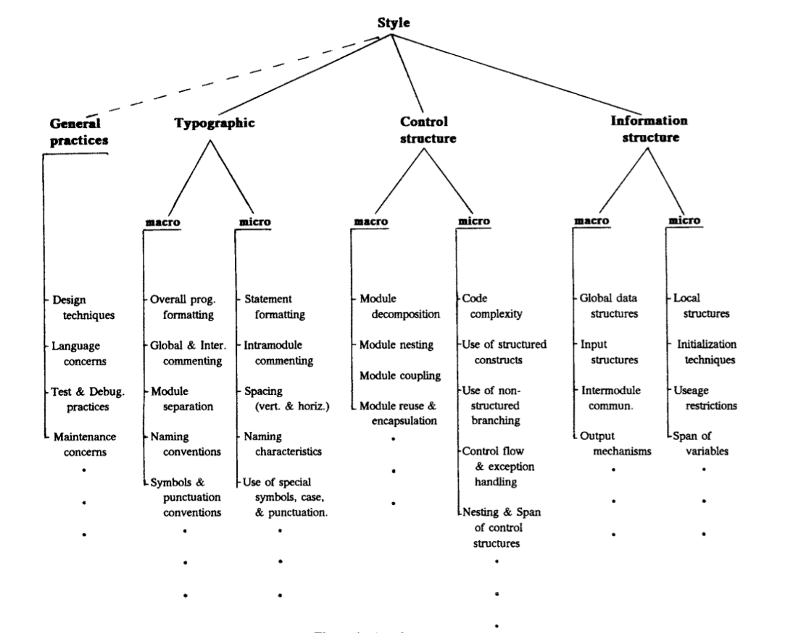

# Εισαγωγή

Στυλ προγραμματισμού (αγγλ. Programming/Coding style ή Coding conventions)
είναι ένα σύνολο κανόνων ή κατευθυντήριων γραμμών που χρησιμοποιούνται κατά την
σύνταξη του πηγαίου κώδικα ενός προγράμματος υπολογιστή σε μια συγκεκριμένη γλώσσα
προγραμματισμού που συνιστά να χρησιμοποιούνται συγκεκριμένες πρακτικές και μέθοδοι
για κάθε πτυχή ενός προγράμματος γραμμένο στην συγκεκριμένη γλώσσα. Ο σκοπός του
προγραμματιστικού στυλ είναι να εξασφαλίσει ότι ο πηγαίος κώδικας είναι γραμμένος με
τρόπο που βελτιώνει την αναγνωσιμότητα του καθώς και την συντηρησιμότητα του 
({{ "wiki:coding_convetions" | cite }}, {{ "wiki:Programming_style" | cite }},
{{ "ala2004supporting" | cite }}, {{ "Mohan" | cite }}, {{ "Oman" | cite }})

Το σύνολο των κανόνων που ισχύουν για την συγγραφή του πηγαίου κώδικα μπορούν να ταξινομηθούν σε 4 τομείς {{ "Mohan" | cite }}:

* **Τυπογραφικά στυλ:** Κανόνες που αφορούν την διάταξη και την εμφάνιση του 
κώδικα καθώς και την χρήση σχολίων, αλλά όχι την εκτέλεση του προγράμματος.
* **Γενικές πρακτικές προγραμματισμού:** Κανόνες και κατευθυντήριες γραμμές 
σχετικά με την μεθοδολογία και την γλώσσα που χρησιμοποιούνται και επηρεάζουν 
τον πηγαίο κώδικα.
* **Δομές ελέγχου:** Κανόνες που επηρεάζουν την χρήση των αλγορίθμων καθώς και 
την υλοποίηση τους.
* **Δομές πληροφοριών:** Κανόνες που επηρεάζουν τις δομές δεδομένων, την ροή 
του προγράμματος καθώς και την αποθήκευση και χειρισμό της πληροφορίας.

Σε αυτή την εργασία θα αναπτυχθούν τα δύο πρώτα θέματα (τυπογραφικό στυλ και
γενικές πρακτικές προγραμματισμού). Αυτές οι κατευθυντήριες γραμμές είναι για
την διαρθρωτική ποιότητα του λογισμικού\footnote{Η διαρθρωτική ποιότητα του
λογισμικού αναφέρεται στο πως οι μη -- λειτουργικές πτυχές του προγραμματισμού
(όπως τα σχόλια, κ.λ.π) βοηθούν στην υλοποίηση των λειτουργικών πτυχών, όπως η
αξιοπιστία του προγράμματος ή ευκολία στην συντήρηση του \cite{wiki:Software_quality}.} (αγγλ. \en{Software structural quality}).

Προβάλλεται συχνά το επιχείρημα ότι ακολουθώντας ένα συγκεκριμένο
προγραμματιστικό στυλ μπορεί να βοηθήσει στην ανάγνωση και κατανόηση του 
πηγαίου κώδικα, και επιπλέον βοηθά στην αποφυγή λαθών αλλά και στην βελτίωση 
της ποιότητας του πηγαίου κώδικα \cite{ala2004supporting,Ayerbe,Cox,WangZH08}
(βλέπε ακόμα σχ. \ref{fig:coding_standard_to_software_quality}). Οι συμβάσεις
που γίνονται όταν ακολουθείται ένα συγκεκριμένο στυλ προγραμματισμού βοηθά 
μόνο τους συντηρητές και τους διορθωτές του πηγαίου κώδικα ενός προγράμματος. Το προγραμματιστικό στυλ δεν επιβάλλεται από τους μεταγλωττιστές. Έτσι ένα πρόγραμμα το οποίο δεν ακολουθεί κάποιους ή όλους τους κανόνες δεν έχει καμία επίδραση στο εκτελέσιμο αρχείο του προγράμματος που δημιουργήθηκε από τον πηγαίο κώδικα \cite{wiki:coding_convetions,wiki:Programming_style}.

\begin{figure}
\begin{center}
\resizebox*{16.5cm}{!}{
\includegraphics{images/coding_standard_to_software_quality.png}}
\caption[Η σχέση μεταξύ προγραμματιστικού στυλ και ποιότητας λογισμικο]{Η σχέση μεταξύ προγραμματιστικού στυλ και ποιότητας λογισμικού \cite{WangZH08}. }
\label{fig:coding_standard_to_software_quality}
\end{center}
\end{figure}

Το στυλ γραφής είναι ένα στοιχεία το οποίο συχνά παραβλέπεται αλλά είναι πολύ κρίσιμο χαρακτηριστικό της γραφής. Το ύφος της γραφής επηρεάζει άμεσα την αναγνωρισιμότητα και κατανόησης του τελικού προϊόντος. Έτσι ομοίως και το στυλ προγραμματισμού, που είναι η συγγραφή του πηγαίου κώδικα σε μία γλώσσα προγραμματισμού, ομοίως πάσχει από αυτή την παραμέληση. Τα προγράμματα πρέπει να είναι αναγνώσιμα και κατανοητά όχι μόνο από τις μηχανές αλλά ομοίως και από τον άνθρωπο. Η απαίτηση αυτή είναι σημαντική για τη δημιουργία ποιοτικών προϊόντων που ανταποκρίνονται όχι μόνο στις ανάγκες των χρηστών, αλλά επίσης μπορούν να αναπτυχθούν εντός προγράμματος και εκτιμώμενου κόστους. Η αποτελεσματική συγγραφή προγραμμάτων έχει ήδη ερευνηθεί από πολύ παλιά (\cite{Kernighan}) από τις πρώτες γλώσσες προγραμματισμού που υπήρχαν όπως η Fortan αλλά συνεχίζει να είναι ακόμα ένα φλέγον ζήτημα \cite{ala2004supporting,Kondoh200682}. 

Το στυλ προγραμματισμού που χρησιμοποιείται σε ένα συγκεκριμένο πρόγραμμα μπορεί να προέρχεται από τις συμβάσεις γραφής (αγγλ. \en{coding conventions}) που έχει κάνει μια εταιρεία ή κάποιος άλλος οργανισμός που ασχολείται με την συγγραφή κώδικά (π.χ. \cite{gnu_coding,site:gnu_style,site:google_cpp,
site:google_style,site:gnu_conventions,site:boost_guidelines,site:linux_style}) καθώς και τις προτιμήσεις του ίδιου του συγγραφέα. Υπάρχουν πολυάριθμες συμβάσεις γραφής που χρησιμοποιούνται για να διασφαλίσουν "συνεπή" (αγλλ. \en{consistent}) κώδικα. Οι συμβάσεις γραφής είναι σημαντικές στους προγραμματιστές διότι μπορούν να προσφέρουν αρκετά πλεονεκτήματα όπως \cite{wikibook:cpp_style,wiki:coding_convetions,sutter2004c++}:
%, οι οποίες βοηθούν στην βελτίωση της ποιότητας του κώδικα, συμπεριλαμβανομένου και την ορθότητα, αναγνωσιμότητα, την συντηρησιμότητα και την ταχύτητα \cite{wikibook:cpp_style}.

\begin{description}
\item [Συντήρηση λογισμικού (αγγλ. \en{Software maintenance}): ] Η  συντήρηση του λογισμικού αντιπροσωπεύει τουλάχιστον το 50\% του κόστους ζωής του λογισμικού\cite{Mohan}, ενώ σε άλλες έρευνες αναφέρετε ότι το 40\% με 80\% τους κόστους ζωής ενός λογισμικού πάει στην συντήρηση του κώδικα \cite{robert2003facts,wiki:coding_convetions}. Η μείωση, λοιπόν, του κόστους συντήρησης είναι ο πιο συχνά αναφερόμενος λόγος για την χρησιμοποίηση συμβάσεων γραφής. Σχεδόν κανένα λογισμικό δεν διατηρείται μόνο από τον αρχικό του δημιουργό. Έτσι οι συμβάσεις αυτές βοηθούν στην καλύτερη κατανόηση του κώδικα, επιτρέποντας και σε άλλους προγραμματιστές να συμμετέχουν στην επέκταση του κώδικα.
\item [Ποιότητα λογισμικού (αγγλ. \en{Software quality}): ] Η αξιολόγηση και η διόρθωση του κώδικα συχνά περιλαμβάνει την ανάγνωση του πηγαίου κώδικα από τρίτους. Εξ ορισμού, μόνο ο αρχικός συντάκτης έχει διαβάσει τον πηγαίο κώδικα πριν την αξιολόγηση του. Ο πηγαίος κώδικας ο οποίος τηρεί κάποιες συμβάσεις είναι πιο κατανοητός στους υπόλοιπους και επομένως η διαδικασία ανίχνευσής σφαλμάτων γίνεται πιο εύκολη. %Ακόμα και για τον αρχικό δημιουργό, όταν ο κώδικας τηρεί κάποιες συμβάσεις, διευκολύνεται η διαδικασία συντήρησης του πηγαίου κώδικα.
\item [Μειώνουν την πολυπλοκότητα: ] Όσο πιο σύνθετο είναι ένα έργο λογισμικού τόσο πιο πιθανό είναι να έχει σφάλματα. Οι σωστές συμβάσεις γραφής βοηθούν στην εύρεση αυτών των σφαλμάτων και στην μείωση της πολυπλοκότητας του πηγαίου κώδικα. %Η καλή μεθοδολογία και οι σωστές συμβάσεις γραφής μπορούν να χρησιμοποιηθούν έτσι ώστε η ποιότητα συγγραφής του κώδικα να είναι καλύτερη και ταυτόχρονα να μειωθεί ο χρόνος ανάπτυξης και συντήρησης της εφαρμογής.
\item [ Βελτιωμένη ταχύτητα ανάπτυξης και καλύτερη ομαδική εργασία: ] Οι προγραμματιστές δεν χρειάζεται να ξεκινούν πάντα από το μηδέν και έχουν μία στέρεα βάση για την ανάπτυξη του λογισμικού, ενώ ταυτόχρονα οι συμβάσεις συμβάλλουν στην μείωση των περιττών συζητήσεων σχετικά με ασήμαντα θέματα και διευκολύνουν στην συνεργασία μεταξύ των προγραμματιστών.
\end{description}

Τέλος τα πεδία που επηρεάζονται από την επιλογή ενός στυλ κώδικα φαίνονται συνοπτικά στο σχήμα \ref{fig:style_quality}.
%\begin{itemize}
%\item Η επαναχρησιμοποίηση του κώδικα  Re-usability
%\item Στην τεκμηρίωση του κώδικα  Self documenting code
%\item Στην συντηρισημότητα του κώδικα Maintainability
%\item Στην φορητότητα του κώδικα Portability
%\item Στην βελτιστοποίηση του κώδικα Optimization
%\item Στην ασφάλεια του κώδικα  Security
%\item Στην αποφυγή λαθών Error avoidance
%\item Internationalization
%\item Build process
%\end{itemize}
\begin{figure}
\begin{center}
\resizebox*{!}{8.5cm}{
\includegraphics{images/style_quality.png}}
\caption[Τα πεδία που επηρεάζονται από την επιλογή ενός στυλ κώδικα]{Τα πεδία που επηρεάζονται από την επιλογή ενός στυλ κώδικα \cite{ala2004supporting}. }
\label{fig:style_quality}
\end{center}
\end{figure}

